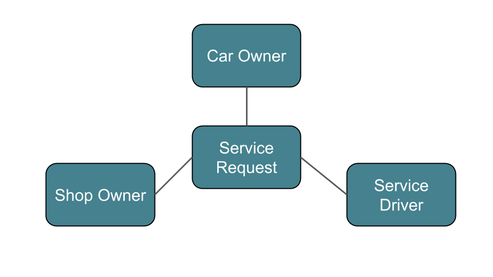

# Auto Concierge

A concierge service that brings together busy professionals who don't have time to wait at the shop while the car's getting fixed, auto service shops that would love to connect with more customers with high satisfaction, and a community of responsible drivers to connect them together.

Does your car need an oil change, regular maintenance or inspection, but have a busy work schedule? Can't wait while the car's getting serviced, or shuttle service not convenient? Aggieland Auto Concierge can send you an excellent drivers who will come to your office, responsibly retrieve your car to one of our member auto service shops, and bring it back to you before it's time to go home.

# User persona & User stories

1. Jason Chen is an assistant director of the international faculty's office of Texas A&M University. The maintenance reminder sticker on his windshield tells him it's past his recommended service date, and would really like to get it done as soon as possible. He can't find time to go to a auto shop, because his work schedule has very busy lately and doesn't seem to be letting off any time soon. As the car owner, Jason would like to:

  * make profile including
    * car information: year/make/model, license plate number, color (for the service drivers), and odometer reading
    * location information of parking lot & office: for the service driver to retrieve the key and locate the car
  * see participating service shops
  * make service request, including type of service and desired date
  * be able to connect with the driver who will retrieve the key for his car on the day of service from his place of his work
  * mark the parking spot on the map to let the student driver know where to find his car in the parking lot

2. Dominique Toretto is an independent auto service shop owner in Bryan,TX. He prides in the exceptional quality of service he provides for the customers who bring their cars to his shop. He would love to increase his business presence and be able to satisfy more customers by servicing their cars right. As the shop owner Dominique would like to:

  * make profile showing the shop location,
  * see the list of service requests, sorted by car year/make/model, and service types,
  * accept service requests made by car owners,
  * update the status of car as
    * checked-in when the car arrives at his shop,
    * service complete when the job is done (alerting both the service driver & the owner)
    * checked-out when the car leaves his shop

3. Jennifer Simpson is a sophomore student at Texas A&M University majoring in political science. Growing up with 3 younger siblings, she has always demonstrated responsibility and loved helping others. She's renting an apartment with 2 of her friends, and would like to earn some extra allowance for the rent and groceries. As service drive, Jennifer would like to:

  * see service requests that are near her current location,
  * see the location of the car owner, and the location of the designated service shop,
  * accept a service drive request,

# Entry Relationship Diagram

# Wireframes

# Technology used

- Python/Django: back-end support
- Materialize UI: mobile-first front-end design
- Google Maps API - used to show on the map (a) the participating service shops, (b) display the location of the parked car upon pick up and return.
- Car Query API - used to as selectable choices when user adds their vehicle to the profiles
- Twitter API - used to announce service driver needed, etc.

# References
Icon made by ([Freepik](https://www.flaticon.com/authors/freepik)) from www.flaticon.com - Automotiles pack ([link](https://www.flaticon.com/packs/automobiles))
